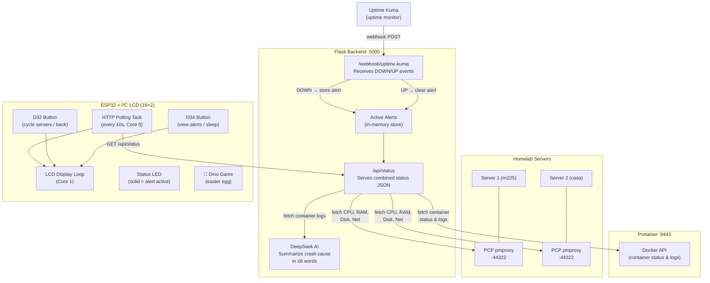

# Vigyl

A hardware server monitoring system that combines a **Python/Flask backend** with an **ESP32 + 16×2 LCD** physical dashboard. Vigyl watches Docker containers across multiple servers, collects hardware metrics, and displays real-time status on a small screen you can put on your desk.

## How It Works



## Components

### Flask Backend (`main.py`)

The backend is the central hub that aggregates data from several sources:

| Source | What It Provides |
|---|---|
| **Uptime Kuma** (webhook) | DOWN/UP notifications for monitored services |
| **Portainer API** | Real-time Docker container status and log retrieval |
| **PCP (pmproxy)** | Hardware metrics — CPU load, RAM %, disk %, network throughput |
| **DeepSeek AI** | ≤6 word AI-generated summary of why a container crashed |

**Endpoints:**

- **`POST /webhook/uptime-kuma`** — Receives webhook payloads from Uptime Kuma. When a service goes down, it stores the alert, queries Portainer for container status/logs, and prints diagnostics. When a service recovers, it clears the alert.
- **`GET /api/status`** (API key protected) — Returns a JSON payload combining hardware stats for all servers and any active alerts (with cached AI crash summaries).

### ESP32 Firmware (`esp32.ino`)

A physical monitoring device built on an ESP32 with a 16×2 I²C LCD, two buttons, and a status LED.

**Architecture:**
- **Core 0** — Background HTTP task polls `/api/status` every 10 seconds
- **Core 1** — Main loop handles LCD rendering, button input (via ISR), and display mode logic
- **Mutex** — `dataMutex` protects shared data between the two cores

**Display Modes:**

| Mode | Description |
|---|---|
| **Server Cycle** | Auto-rotates through servers showing CPU/RAM bars and Disk/Network stats |
| **New Alert** | Interrupts cycling to show newly detected alerts with scrolling text |
| **Alert View** | Manual mode (D34 button) to browse all active alerts |
| **Dino Game** | 🦕 Easter egg — hold both buttons for 5 seconds |

**Button Controls:**
- **D32** — Cycle to next server screen / exit alert view
- **D34** — Enter alert view / browse alerts
- **D34 hold (5s)** — Enter sleep mode (screen off, polling paused)
- **Both hold (5s)** — Toggle dino game easter egg

**LCD Features:**
- Custom characters for up/down arrows, network indicators, and dino game sprites
- Compact bar-graph rendering for CPU and RAM percentages
- Auto-scrolling text for alert messages longer than 16 characters
- Connection spinner animation during Wi-Fi setup
- Supports WPA2-Personal and WPA2-Enterprise networks

## Quick Start

### Backend
```bash
pip install flask requests
python main.py
```
The Flask server starts on `0.0.0.0:5000`.

### ESP32
1. Install the following Arduino libraries: `ArduinoJson`, `LiquidCrystal_I2C`
2. Fill in the config values at the top of `esp32.ino` (WiFi credentials, API URL, API key)
3. Wire the LCD via I²C (SDA → GPIO 18, SCL → GPIO 21), buttons to GPIO 32 & 34, LED to GPIO 2
4. Flash to your ESP32

## License

This project is unlicensed — feel free to use it however you'd like.
